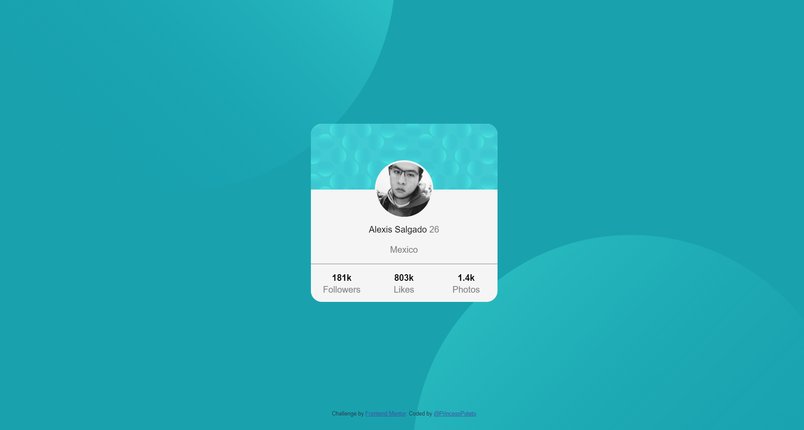

<h1 align="center">Profile card</h1>

  <h3>
    <a href="https://princesspoteto.github.io/CardPorfile/">
      Live site
    </a>
     | 
    <a href="https://www.frontendmentor.io/solutions/profile-card-2VyWAiqxq">
      Solution
    </a>
     | 
    <a href="https://www.frontendmentor.io/challenges/profile-card-component-cfArpWshJ">
      Challenge
    </a>
  </h3>

   Solution for a challenge from  <a href="https://www.frontendmentor.io/" target="_blank">Frontendmentor.io</a>.

---

## Table of contents

- [Overview](#overview)
  - [Built with](#built-with)
- [Contact](#contact)

<!-- Overview section -->

## Overview

- Frontend Mentor challenges help you improve your coding skills by building realistic projects.

- You can see a live site at [Profile Card Component](https://princesspoteto.github.io/CardPorfile/)

### Built with

- CSS custom properties
- Flexbox
- Mobile-first workflow

<!-- Contact section -->

##  Contact

- Github Repositories [@PrincessPoteto](https://github.com/PrincessPoteto)

- Frontend Mentor [@PrincessPoteto](https://www.frontendmentor.io/profile/PrincessPoteto)

---

    
PrincessPoteto 2021

